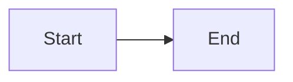

# Personal Portfolio & Blog

Technical blog for experienced software professionals. Built with Astro, deployed on GitHub Pages.

## Documentation

- [Project Implementation](./docs/project-implementation.md) - Architecture, content collections, search, and deployment
- [Markdown Features](./docs/markdown-features.md) - Complete markdown reference including code blocks and diagrams
- Guidelines:
  - `guidelines/document/` (content writing, research, markdown, persona)
  - `guidelines/coding/` (codebase changes)

## Quick Start

```bash
npm install          # Install dependencies
npm run dev          # Development server
npm run build        # Production build
npm run preview      # Preview production build locally
```

## Content Structure (Current)

```
content/
├── articles/
│   ├── <category>/
│   │   ├── README.md
│   │   └── <topic>/
│   │       ├── README.md
│   │       └── <article>/
│   │           └── README.md
├── ordering.json5   # Global ordering config
├── home.json5       # Homepage config
├── site.json5       # Site metadata
└── vanity.json5     # Redirects
```

## Writing Content

### Article Location

```
content/articles/<category>/<topic>/<article>/README.md
```

### Document Structure

````markdown
# Article Title

Description paragraph(s) - becomes meta description.

<figure>


````

<figcaption>Short caption</figcaption>
</figure>

## TLDR

## Section One

## Conclusion

## References

````

### Auto-Extracted Fields

| Field         | Source                             |
| ------------- | ---------------------------------- |
| `title`       | First H1 heading                   |
| `description` | Paragraphs between H1 and first H2 |
| `minutesRead` | Calculated from content            |
| `isDraft`     | H1 starts with `Draft:`            |
| `pageSlug`    | Derived from file path             |
| `category`    | Derived from folder path           |
| `topic`       | Derived from folder path           |
| `postId`      | Article folder name                |

### Draft Posts

Prefix title with "Draft:" to mark as draft:

```markdown
# Draft: Work in Progress
````

### Ordering (Required)

Add new categories, topics, and articles to `content/ordering.json5`:

- `categoryOrder`, `topicsOrder`, `articlesOrder`
- `categoryVsTopics`, `topicVsArticlesOrder`

## Content Collections

| Collection | Path                                                      | Notes            |
| ---------- | --------------------------------------------------------- | ---------------- |
| category   | `content/articles/<category>/README.md`                   | H1 + description |
| topic      | `content/articles/<category>/<topic>/README.md`           | H1 + description |
| article    | `content/articles/<category>/<topic>/<article>/README.md` | Full article     |

## Markdown Features

### Code Blocks (Expressive Code)

````markdown
```ts title="file.ts" collapse={1-3} {5-7}
// Lines 1-3 collapsed (imports)
import { a } from "a"
import { b } from "b"

// Lines 5-7 highlighted
function main() {
  return "hello"
}
```
````

**Key features:**

- `title="filename"` - Add file context
- `collapse={1-5}` - Collapse boilerplate lines (show only key lines)
- `{2-4}` - Highlight lines
- `+` / `-` - Diff syntax
- Line numbers shown by default (except bash/txt)

### Mermaid Diagrams

````markdown

````

### Images

```markdown
 # Standard
 # Inverts in dark mode
 # Inlined SVG
```

---

## Using Claude Code

This repo uses global devkit skills for content creation.

### Skills

| Command                           | Description                                |
| --------------------------------- | ------------------------------------------ |
| `/article <topic>`               | Write new article with deep research       |
| `/article update <path> <prompt>`| Update existing article with deep research |
| `/project-docs <folder>`         | Write/update project page from local code  |
| `/blog <topic>`                  | Write a blog post                          |

### Example Workflows

#### Write a New Article

```
/article Node.js event loop internals - covering phases and common pitfalls
```

#### Update an Existing Article

```
/article update content/articles/web-foundations/networking-protocols/http1-1-to-http2-evolution/README.md add a section on HTTP/3 0-RTT risk trade-offs
```

### Key Guidelines

1. **Content**: Use `guidelines/document/` for all article work
2. **Code**: Use `guidelines/coding/` only when changing site functionality
3. **Code blocks**: Collapse non-essential lines with `collapse={...}`
4. **Audience**: Senior/staff/principal engineers
5. **Conciseness**: No padding, no filler, every paragraph earns its place

### Configuration

- `.claude/rules.md` - Project rules and skill reference
- `.claude/settings.local.json` - Permissions
- `guidelines/document/` - Content guidelines
- `guidelines/coding/` - Coding guidelines

---

## Development

```bash
npm run check        # TypeScript type checking
npm run lint         # ESLint
npm run format       # Prettier
npm run test         # Vitest
```

### TypeScript

Uses `astro/tsconfigs/strictest` - no implicit any, strict null checks.

### Path Aliases

```typescript
import { helper } from "@/utils/helper"
import { SITE } from "@constants/site"
```
